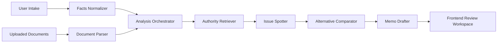

# Architecture Proposal

## Goals
- Build a tax analysis system that is modular, reviewable, and citation-aware.
- Separate fact handling from authority retrieval and reasoning output.
- Make it easy to swap seeded components for production services later.

## System Overview
Tax LLM v1 can be thought of as a pipeline:

1. Intake structured transaction facts.
2. Parse uploaded deal materials into normalized document artifacts.
3. Retrieve relevant tax authorities and internal knowledge snippets.
4. Identify likely tax issues triggered by the facts.
5. Compare structural alternatives against those issues.
6. Draft a memo-style output with citations and explicit assumptions.
7. Produce missing-facts questions for follow-up.

## Module Design

### Frontend
- Intake workspace for transaction facts and uploaded materials
- Analysis review UI for issues, alternatives, and memo sections
- Citation panel for retrieved authorities
- Demo mode powered by seeded fixtures

### Backend
- `domain/`
  - canonical entities such as `TransactionFacts`, `TaxIssue`, `AuthorityCitation`, `StructuralAlternative`, `MemoDraft`
- `application/`
  - orchestration use cases such as `AnalyzeTransactionUseCase`
- `infrastructure/`
  - adapters for document parsing, authority retrieval, fixture repositories
- `interfaces/api/`
  - transport layer with FastAPI routes and DTO mapping

## Data Flow

## Suggested Future Extensions
- vector + metadata retrieval over tax authorities
- workflow state per deal
- memo generation with section-specific prompts
- human review annotations
- eval runner that scores authority coverage and issue recall
